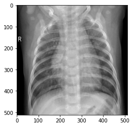

# Dataset_4C_D_RGB

The Dataset_4C_D_RGB.hdf5 file consists in 3099 images in RGB scale, divided in 4 classes. There are 2169 training images, 465 validation images and 465 test images. (70% for training, 15% for validation and 15% for testing)

The images are getting from
https://www.kaggle.com/paultimothymooney/chest-xray-pneumonia and
https://github.com/lindawangg/COVID-Net

    Author: Sergio Luis Beleño Díaz
    Date: 2020-02-02

The classes are:

    Normal: 1000
    Pneumonia Vir: 1000
    Pneumonia Bact: 1000
    COVID-19: 99

Labels:

    Normal ==> 0
    Pneumonia Vir ==> 1
    Pneumonia Bact ==> 2
    COVID-19 ==> 3
    
Size:

    (512,512,3)
    

